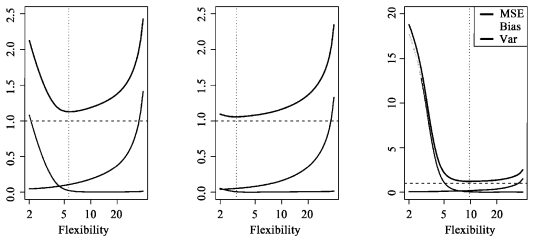

# 第二章 统计学习

## 2.1 什么是统计学习

**输入变量**通常用 **X** 表示，也称为**预测变量**、**自变量**、**属性变量**

**输出变量**通常用 **Y** 表示，也称为**响应变量**、**因变量**
$$
Y = f(X) + ε
$$
f是X的函数，固定但未知，f表达了X提供给Y的系统信息，ε是**随机误差项**（与X独立，均值为0）

#### 2.1.1 什么情况下需要估计f

**预测**和**推断**。

##### 预测

预测主要关心f的估计值的准确性，不关注其是如何预测的（将f当作黑箱）

精确性包括**可约误差**与**不可约误差**，可约误差可以通过选择更合适的统计学习方法降低

##### 推断

推断主要关心$X_1$,$X_2$,...变化时如何对Y产生影响（不能将f当作黑箱）

#### 2.1.2 如何估计f

估计任务大多可分为**参数方法**和**非参数方法**

##### 参数方法

假设函数f具有一定的形式，用训练数据集去拟合模型（估计参数），即把估计f的问题简化到估计一组参数

> 过拟合：拟合了错误或噪声

##### 非参数方法

不对函数f的形式做明确的假设，追求尽可能接近数据点

（薄板样条）

#### 2.1.3 预测精度和模型解释性的权衡

一般来说，当一种方法的光滑度增强时，其解释性减弱

#### 2.1.4 指导学习和无指导学习

指导学习：数据集中有对应的响应变量来指导数据分析

> 逻辑斯蒂回归、支持向量机

无指导学习：数据集缺乏一个响应变量来指导数据分析

> 聚类分析

半指导学习：部分有，部分没有

#### 2.1.5 回归与分类问题

变量常分为**定量**和**定性**两种类型。响应变量定量是回归问题，响应变量定性则是分类问题

## 2.2 评价模型精度

#### 2.2.1 拟合效果检验

常用的评价准则是**均方误差**（mean squared error, **MSE**）
$$
MSE = \frac{1}{n}\sum_{i=1}^{n}(y_i-\hat{f}(x_i))^2
$$
我们的目标是使模型的测试均方误差最低

当模型的光滑度增加时，训练均方误差降低，但是测试均方误差不一定降低

> 当模型有较小的训练均方误差，但是有较大的测试均方误差时，称为过拟合
>
> 降低模型的光滑度可以减小测试均方误差

##### 自由度

自由度是描述曲线光滑程度的正式术语

#### 2.2.2 偏差-方差权衡

$$
E(y_0-\hat{f}(x_0))^2=Var(\hat{f}(x_0))+[Bias(\hat{f}(x_0))]^2+Var(ε)
$$

> 测试均方误差的期望能分解为：预测值$\hat{f}(x_0)$的方差、预测值$\hat{f}(x_0)$的偏差的平方、误差项ε的方差

因此我们需要得到一个偏差和方差综合起来最小的模型

##### 偏差

偏差（bias）指的是为了选择一个简单的模型逼近真实函数而被带入的误差

##### 方差

方差（variance）代表的是用一个不同的训练数据集估计f时，估计函数的改变量

如果一个统计学习模型被称为测试性能好，则要求该模型有较小的方差和较小的偏差

贝叶斯分类器、K最近邻方法