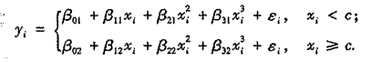
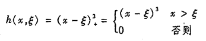

# 第七章 非线性模型

## 多项式回归

$$
y=β_0+β_1x_i+β_2x_i^2+β_3x_i^3+...+β_dx_i^d+ε_i
$$

## 阶梯函数

创建分割点$c_1,c_2,...,c_K$，然后构造K+1个新变量：$C_0(X)=I(X<c_1),...,C_K(X)=I(c_k≤X)$
$$
y_i=β_0+β_1C_1(x_i)+β_2C_2(x_i)+...+β_KC_K(x_i)+ε_i
$$

### 基函数

多项式和阶梯函数回归模型实际上是特殊的基函数方法，对变量X的函数变换$b_1(X),b_2(X),...,b_K(X)$进行建模
$$
y_i=β_0+β_1b_1(x_i)+β_2b_2(x_i)+...+β_Kb_K(x_i)+ε_i
$$

## 回归样条

不同区域拟合不同的多项式函数，可以这样表示

没有约束的有K个结点的三次样条会产生4K+4个自由度

有K个结点的三次样条会产生K+4个自由度（原因是每个结点处增加了三个约束：连续、一阶导连续、二阶导连续）

同时也可以使用样条基函数表示
$$
y_i=β_0+β_1b_1(x_i)+β_2b_2(x_i)+...+β_{K+3}b_{K+3}(x_i)+ε_i
$$

### 截断幂基

在上述基函数式子中，可以选择不同的基函数得到等价的三次样条，比如截断幂基的方式是先以三次多项式的基为基础（$x,x_2,x_3$），然后在每个结点添加一个截断幂基函数

其中ξ是结点

### 确定结点的个数和位置

使用交叉验证确定：首先移除10%的数据，用剩余的数据拟合，然后对那部分被移除的数据进行预测（10折交叉验证），最后计算整体的交叉验证RSS。整个过程对不同的结点数K不断尝试

回归样条通常结果比多项式回归好且稳定，回归样条通过固定自由度但是多设立结点的方式来获得稳定的估计结果

## 光滑样条

如果对$g(x_i)$不添加任何约束条件，只能得到一个取值为0的RSS，这样的函数对数据严重过拟合。而实际上真正需要的g是满足RSS尽量小，同时曲线尽量平滑（较少的突变，光滑度下降）

可以通过最小化下式
$$
\sum_{i=1}^{n}(y_i-g(x_i))^2+λ\int g''(t)^2dt
$$
λ由0增至∞，实际自由度$df_{λ}$从n降至2

## 局部回归

选取s=k/n比例的最靠近$x_0$的数据$x_i$

对选出的数据赋予其权重$K_{i0}=K(x_i,x_0)$，离$x_0$最远的点权重为0，而最近的点权重最高

用定义好的权重在$x_i$处拟合加权最小二乘回归

根据$\hat{f}(x_0)=\hat{β}_0+\hat{β}_1x_0$得到$x_0$的拟合结果

## 广义可加模型

每一个变量用一个非线性函数替换
$$
y_i=β_0+f_1(x_{i1})+f_2(x_{i2})+...+f_p(x_{ip})+ε_i
$$

### GAM的优点与不足

- 允许每一个$X_i$都拟合一个非线性$f_i$，非线性拟合模型能预测得更精准，且模型可加，能保持其他变量不变情况下观测单变量对Y的影响效果

- 局限在于形式被限定为可加形式

### 用于分类的GAM

用逻辑斯蒂回归的对数发生比即可
$$
log(\frac{p(X)}{1-p(X)})=β_0+f_1(X_1)+f_2(X_2)+...+f_p(X_p)
$$

$$
p(X)=Pr(y>n|f_1(X),f_2(X),f_3(X)...)
$$

