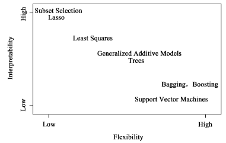

# 各模型偏差-方差均衡以及光滑度-可解释性均衡

## 偏差-方差均衡

| 模型           | 偏差减小，方差增大 | 方差减小，偏差增大 |
| -------------- | ------------------ | ------------------ |
| 线性回归       | 系数个数增多       | 系数个数减少       |
| K最近邻（KNN） | K减小              | K增大              |
| 岭回归/Lasso   | λ减小              | λ增大              |
| 多项式回归     | 最高项次数增大     | 最高项次数减小     |
| 阶梯函数       | 分割点个数增多     | 分割点个数减少     |
| 回归样条       | 自由度增大         | 自由度减小         |
| 光滑样条       | λ减小              | λ增大              |
| 局部回归       | 比例s减小          | 比例s增大          |
| 广义可加模型   | --                 | --                 |
| 决策树         | α减小              | α增大              |
| 支持向量分类器 | C减小/cost值增大   | C增大/cost值减小   |

## 光滑度-可解释性均衡

