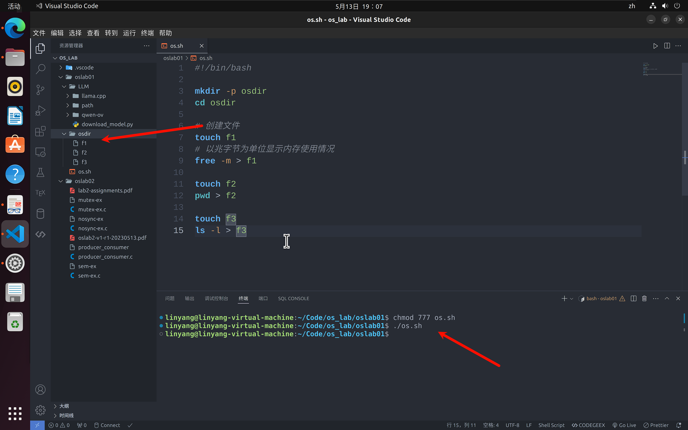
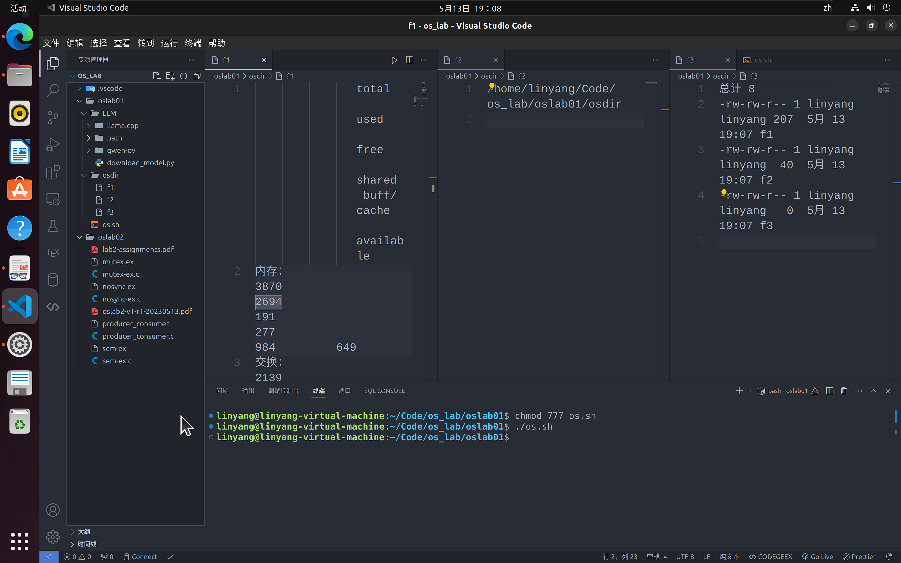

# oslab 01

软件2209 林洋 20222241379

本次实验要求写一个 `shell` 脚本，实现 PDF 中的功能

脚本如下：

```shell
#!/bin/bash

mkdir -p osdir
cd osdir

# 创建文件
touch f1
# 以兆字节为单位显示内存使用情况
free -m > f1

touch f2
pwd > f2

touch f3
ls -l > f3
```

运行截图如下：



