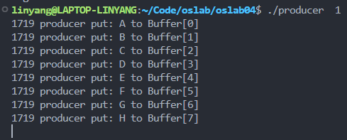
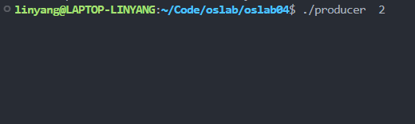
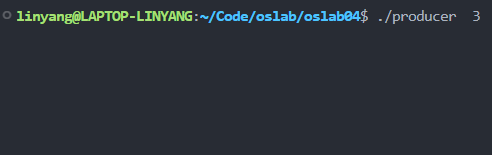
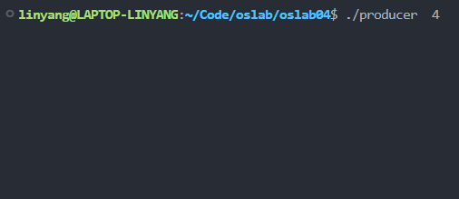
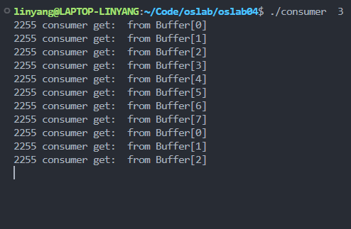
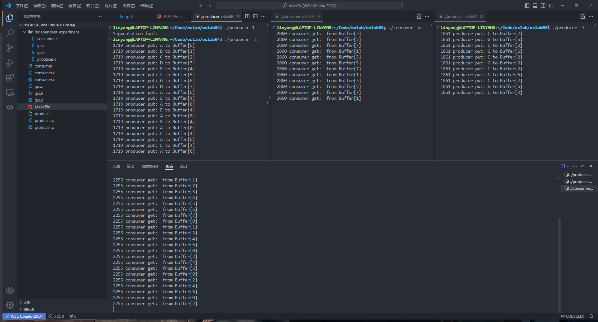

# oslab 04

软件2209 林洋 20222241379

## 真实操作系统中提供的并发进程同步机制是怎样实现和解决同步问题的？

真实操作系统中提供的并发进程同步机制包括互斥锁、信号量等

互斥锁是一种并发编程中常用的同步机制，用于实现对共享资源的互斥访问，防止多个进程或线程同时访问和修改共享资源而引发的竞态条件问题。在进程或线程访问共享资源之前，先尝试获取互斥锁，如果互斥锁已被其他进程或线程占用，则当前进程或线程将被阻塞等待，直到互斥锁被释放。一旦获得互斥锁，进程或线程可以安全地访问共享资源，并在使用完毕后释放互斥锁，使其他进程或线程可以获取锁继续执行

信号量是一种并发编程中常用的同步机制，用于实现对共享资源的访问控制和同步操作。它可以用于解决多进程或多线程之间的同步和互斥问题。信号量的概念是一个带有计数器的变量，它可以被多个进程或线程同时访问和修改。信号量的值用于表示可用的资源数量或某种特定条件的状态。信号量有两种基本操作， 一是 P 操作：如果信号量的值大于 0，则将其减 1；如果值为 0，则进程或线程会被阻塞等待。二是 V 操作：将信号量的值加 1，唤醒一个或多个等待的进程或线程

在生产者消费者问题中，可以使用信号量来实现对生产者和消费者之间的缓冲区进行同步和互斥控制。首先创建一个共享缓冲区，用于生产者将数据放入缓冲区，消费者从缓冲区读取数据。创建两个信号量，分别用于表示缓冲区中可用的空槽位数量和已填充的数据数量。这两个信号量分别称为"empty"和"full"。将"empty"信号量初始化为缓冲区的大小（ 表示初始时缓冲区中有多少个空槽位），将"full"信号量初始化为 0（ 表示初始时缓冲区中没有已填充的数据）。创建多个生产者进程和消费者进程，每个进程都会执行相应的生产或消费操作。对于生产者：检查"empty"信号量的值，如果大于 0，表示还有空槽位可以放入数据，可以执行生产操作。执行生产操作，将数据放入缓冲区。将"empty"信号量的值减 1，表示一个空槽位被占用。如果此时"full"信号量的值为 0（ 表示没有数据可用），则执行 V 操作（ 增加"full"信号量的值），唤醒等待的消费者进程。对于消费者：检查"full"信号量的值，如果大于 0，表示缓冲区中有数据可供消费，可以执行消费操作。执行消费操作，从缓冲区读取数据。将"full"信号量的值减 1，表示一个数据被消费。如果此时"empty"信号量的值为 0（ 表示没有空槽位可用），则执行 V 操作（ 增加"empty"信号量的值），唤醒等待的生产者进程。

在抽烟者问题中创建三个信号量：分别表示三种资源，烟草（key_tobacco）、纸（key_paper）和胶水（key_glue）。将三个资源的信号量分别初始化为 0，表示初始时没有任何资源可用。创建两个进程：代表两个供应者。这三个进程会分别提供烟草、纸和胶水，以供抽烟者使用。创建抽烟者进程：每个抽烟者进程都需要两种资源才能抽烟，例如需要烟草和纸。创建 3 个抽烟者进程，每个进程都等待所需的两种资源。对于供应者：先检查所提供的资源是否满足抽烟者的需求。如果满足，则执行供应操作，执行供应操作后，将相关资源的信号量进行 V 操作（ 增加信号量的值），表示该资源可用。如果此时有等待该资源的抽烟者进程，则执行 V 操作，唤醒等待的抽烟者进程。 对于抽烟者进程：检查所需资源的信号量，如果满足条件（ 表示两种资源都可用），则执行抽烟操作。执行抽烟操作后，将相关资源的信号量进行 P 操作（ 减少信号量的值），表示使用了资源。如果此时有供应者进程提供了所需资源，则执行 P 操作，获取资源并执行抽烟操作。另外利用信号量也可以实现互斥锁同步机制，在生产者或抽烟者进入缓冲区时对互斥锁 mutex 进行 P 操作，确保缓冲区被占时自身不会进入以及占用缓冲区时其他进程不会进入

## 信号灯机制是怎样完成进程的互斥和同步的？

### 互斥信号灯：
互斥信号灯的计数器初始值为1，用于实现互斥锁的功能。它只允许一个进程访问特定的资源。

- **P操作**：当进程需要访问资源时，它会执行P操作。如果信号灯的计数器大于0，计数器减1，进程继续执行。如果计数器为0，则进程将被阻塞，直到信号灯的值大于0。
- **V操作**：当进程完成对资源的访问后，它会执行V操作。这将信号灯的计数器增加1，如果有其他进程在等待，操作系统会选择一个进程唤醒它。

### 计数信号灯：
计数信号灯的计数器初始值可以是任意正整数，用于控制多个进程对资源的访问。

- **P操作**：如果信号灯的计数器大于0，计数器减1，进程可以访问资源。如果计数器为0，进程将被阻塞。
- **V操作**：计数器增加1，如果有进程在等待，操作系统将选择一个进程并唤醒它。

### 互斥和同步的实现：
1. **互斥**：通过互斥信号灯，可以保证在任何时刻只有一个进程可以访问特定的资源。这是通过P操作来实现的，如果信号灯的值大于0，进程可以进入临界区；如果为0，则进程将被阻塞，直到信号灯的值变为正数。

2. **同步**：计数信号灯可以用于同步多个进程的执行。例如，一个进程可以等待其他进程完成初始化工作后再开始执行。这可以通过设置信号灯的初始值为0，然后让其他进程在完成初始化后执行V操作来实现。

## 信号量的初值和其值的变化的物理意义是什么?

- **信号量的初值**：反映了系统开始时可用资源的数量或者特定条件的满足程度。
- **信号量值的减少**：表示资源被占用，或者某个条件不再满足。
- **信号量值的增加**：表示资源被释放，或者某个条件再次满足。

## 使用多于 4 个的生产者和消费者

先运行4个生产者：

可以看到 1719 号进程向共享内存写入了8个字符后因缓冲区满而阻塞

再启动一个速率为 3 的消费者进程

再启动一个速率为 6 的消费者进程

经观察能够满足同步的需求

