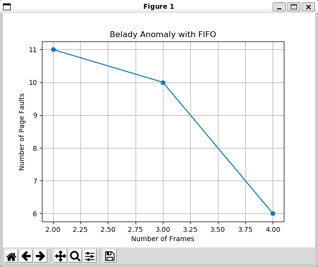

# oslab 05

软件2209 林洋 20222241379

## 时钟（二次机会）置换算法

```c++
void Replace::Clock(void) {
    InitSpace("Clock");
    int pointer = 0;                     // 指向下一个要替换的页面
    bool* used = new bool[FrameNumber];  // 用于记录页面是否被访问过
    int eliminateIndex = 0;              // 用于记录淘汰页的索引

    for (int i = 0; i < FrameNumber; i++) {
        used[i] = false;
    }

    for (int k = 0; k < PageNumber; k++) {
        int next = ReferencePage[k];
        bool found = false;

        // 检查页面是否在帧中
        for (int i = 0; i < FrameNumber; i++) {
            if (PageFrames[i] == next) {
                found = true;
                used[i] = true;  // 将页面标记为已访问
                break;
            }
        }

        if (!found) {
            FaultNumber++;
            // 找到一个没有被访问过的页面进行替换
            while (used[pointer]) {
                used[pointer] = false;
                pointer = (pointer + 1) % FrameNumber;
            }

            // 记录被淘汰的页面
            if (PageFrames[pointer] != -1) {
                EliminatePage[eliminateIndex++] = PageFrames[pointer];
            }

            // 进行页面替换
            PageFrames[pointer] = next;
            used[pointer] = true;
            pointer = (pointer + 1) % FrameNumber;
        }

        // 报告当前实存中页号
        for (int j = 0; j < FrameNumber; j++) {
            if (PageFrames[j] >= 0)
                cout << PageFrames[j] << " ";
        }
        if (!found && eliminateIndex > 0 &&
            EliminatePage[eliminateIndex - 1] > 0)
            cout << "->" << EliminatePage[eliminateIndex - 1] << endl;
        else
            cout << endl;
    }

    delete[] used;
    Report();
}
```

## 增强二次机会置换算法

```c++
void Replace::Eclock(void) {
    InitSpace("EClock");
    int pointer = 0;                     // 指向下一个要替换的页面
    bool* used = new bool[FrameNumber];  // 用于记录页面是否被访问过
    bool* modified = new bool[FrameNumber];  // 用于记录页面是否被修改过
    int eliminateIndex = 0;                  // 用于记录淘汰页的索引

    for (int i = 0; i < FrameNumber; i++) {
        used[i] = false;
        modified[i] = false;
    }

    for (int k = 0; k < PageNumber; k++) {
        int next = ReferencePage[k];
        bool found = false;

        // 检查页面是否在帧中
        for (int i = 0; i < FrameNumber; i++) {
            if (PageFrames[i] == next) {
                found = true;
                used[i] = true;      // 将页面标记为已访问
                modified[i] = true;  // 假设页面被访问时也被修改
                break;
            }
        }

        if (!found) {
            FaultNumber++;
            // 找到一个没有被访问过的页面进行替换
            while (used[pointer] || modified[pointer]) {
                if (used[pointer]) {
                    used[pointer] = false;
                } else if (modified[pointer]) {
                    modified[pointer] = false;
                    used[pointer] = true;  // 第二次机会
                }
                pointer = (pointer + 1) % FrameNumber;
            }

            // 记录被淘汰的页面
            if (PageFrames[pointer] != -1) {
                EliminatePage[eliminateIndex++] = PageFrames[pointer];
            }

            // 进行页面替换
            PageFrames[pointer] = next;
            used[pointer] = true;
            modified[pointer] = false;  // 新页面假设未被修改
            pointer = (pointer + 1) % FrameNumber;
        }

        // 报告当前实存中页号
        for (int j = 0; j < FrameNumber; j++) {
            if (PageFrames[j] >= 0)
                cout << PageFrames[j] << " ";
        }
        if (!found && eliminateIndex > 0 &&
            EliminatePage[eliminateIndex - 1] > 0)
            cout << "->" << EliminatePage[eliminateIndex - 1] << endl;
        else
            cout << endl;
    }

    delete[] used;
    delete[] modified;
    Report();
}
```

## 最不经常使用置换算法

```c++
void Replace::Lfu(void) {
    InitSpace("LFU");
    int* frequency = new int[FrameNumber];  // 记录每个页面的使用频率
    int eliminateIndex = 0;                 // 用于记录淘汰页的索引

    for (int i = 0; i < FrameNumber; i++) {
        frequency[i] = 0;
    }

    for (int k = 0; k < PageNumber; k++) {
        int next = ReferencePage[k];
        bool found = false;

        // 检查页面是否在帧中
        for (int i = 0; i < FrameNumber; i++) {
            if (PageFrames[i] == next) {
                found = true;
                frequency[i]++;  // 增加页面的使用频率
                break;
            }
        }

        if (!found) {
            FaultNumber++;
            // 找到使用频率最低的页面进行替换
            int minFreqIndex = 0;
            for (int i = 1; i < FrameNumber; i++) {
                if (frequency[i] < frequency[minFreqIndex]) {
                    minFreqIndex = i;
                }
            }

            // 记录被淘汰的页面
            if (PageFrames[minFreqIndex] != -1) {
                EliminatePage[eliminateIndex++] = PageFrames[minFreqIndex];
            }

            // 进行页面替换
            PageFrames[minFreqIndex] = next;
            frequency[minFreqIndex] = 1;  // 新页面初始使用频率为1
        }

        // 报告当前实存中页号
        for (int j = 0; j < FrameNumber; j++) {
            if (PageFrames[j] >= 0)
                cout << PageFrames[j] << " ";
        }
        if (!found && eliminateIndex > 0 &&
            EliminatePage[eliminateIndex - 1] > 0)
            cout << "->" << EliminatePage[eliminateIndex - 1] << endl;
        else
            cout << endl;
    }

    delete[] frequency;
    Report();
}
```

## 最经常使用置换算法

```c++
void Replace::Mfu(void) {
    InitSpace("MFU");
    int* frequency = new int[FrameNumber];  // 记录每个页面的使用频率
    int eliminateIndex = 0;                 // 用于记录淘汰页的索引

    for (int i = 0; i < FrameNumber; i++) {
        frequency[i] = 0;
    }

    for (int k = 0; k < PageNumber; k++) {
        int next = ReferencePage[k];
        bool found = false;

        // 检查页面是否在帧中
        for (int i = 0; i < FrameNumber; i++) {
            if (PageFrames[i] == next) {
                found = true;
                frequency[i]++;  // 增加页面的使用频率
                break;
            }
        }

        if (!found) {
            FaultNumber++;
            // 找到使用频率最高的页面进行替换
            int maxFreqIndex = 0;
            for (int i = 1; i < FrameNumber; i++) {
                if (frequency[i] > frequency[maxFreqIndex]) {
                    maxFreqIndex = i;
                }
            }

            // 记录被淘汰的页面
            if (PageFrames[maxFreqIndex] != -1) {
                EliminatePage[eliminateIndex++] = PageFrames[maxFreqIndex];
            }

            // 进行页面替换
            PageFrames[maxFreqIndex] = next;
            frequency[maxFreqIndex] = 1;  // 新页面初始使用频率为1
        }

        // 报告当前实存中页号
        for (int j = 0; j < FrameNumber; j++) {
            if (PageFrames[j] >= 0)
                cout << PageFrames[j] << " ";
        }
        if (!found && eliminateIndex > 0 &&
            EliminatePage[eliminateIndex - 1] > 0)
            cout << "->" << EliminatePage[eliminateIndex - 1] << endl;
        else
            cout << endl;
    }

    delete[] frequency;
    Report();
}
```

## 生成随机内存引用串

为了测试页置换算法，编写 `shell` 脚本生成 `n` 个 20 以内的随机数作为内存引用串

```shell
#!/bin/bash

n=$((RANDOM % 100 + 1))

numbers=()
for (( i=0; i<n; i++ ))
do
    numbers+=($((RANDOM % 20 + 1)))
done

echo "100以内随机正整数 n: $n"
echo "随机内存引用串: ${numbers[@]}"

./vmrp <<EOF
$n
${numbers[@]}
3
EOF
```

命中率的排序是： LRU > LFU > Eclock > Clock > FIFO > MFU

## 绘图分析 

绘制FIFO页面置换算法的曲线图展示Belady异常

```python
import matplotlib.pyplot as plt

# 页面访问序列
reference_string = [0, 1, 2, 0, 3, 4, 2, 1, 2, 0, 3, 4]

# 页面数量
num_frames = [2, 3, 4]

# 计算每个页面数量下的页面置换次数
num_page_faults = []
for frames in num_frames:
    page_faults = 0
    current_frames = []
    for page in reference_string:
        if page not in current_frames:
            page_faults += 1
            if len(current_frames) < frames:
                current_frames.append(page)
            else:
                # 使用FIFO算法，移除最早进入的页面
                current_frames.pop(0)
                current_frames.append(page)
    num_page_faults.append(page_faults)

# 绘制曲线图
plt.plot(num_frames, num_page_faults, marker='o')
plt.title('Belady Anomaly with FIFO')
plt.xlabel('Number of Frames')
plt.ylabel('Number of Page Faults')
plt.grid(True)
plt.show()
```



## 模拟过程讲解

### 二次机会算法

这段程序模拟的是二次机会页面置换算法（Second-Chance Algorithm），它是一种改进的最近最少使用（LRU）算法，用于操作系统中的页面管理。二次机会算法试图通过给页面第二次机会来减少不必要的页面置换。

下面是程序的逐步解释：

1. `InitSpace("Clock");`：用于初始化页面帧数组`PageFrames`
2. `int pointer = 0;`：`pointer`变量用于指向下一个可能被替换的页面
3. `bool* used = new bool[FrameNumber];`：这个布尔数组用于记录页面是否被访问过
4. `int eliminateIndex = 0;`：用于记录被淘汰页面的索引。
5. 循环初始化`used`数组，将所有页面标记为未访问
6. 外层循环遍历所有页面引用（`PageNumber`）：

   - 内层循环检查当前页面是否已经在帧中（即是否已经被加载）
   - 如果页面在帧中，将其对应的`used`标记为`true`
7. 如果页面不在帧中（`!found`），则发生缺页，需要进行页面置换：
   - 使用`pointer`指针寻找一个未被访问过的页面进行替换
   - 循环直到找到一个`used`为`false`的页面，将其标记为已访问（`used[pointer] = true`）
8. 在找到要替换的页面后，记录被淘汰的页面，并更新`PageFrames`数组
9. 每次页面访问后，打印当前帧中的页面号
10. 如果发生了页面置换，打印被淘汰的页面号
11. 程序结束时，释放`used`数组，并调用`Report()`函数报告结果增强二次机会算法

### 增强二次机会算法

1. `InitSpace("EClock");`：用于初始化页面帧数组`PageFrames`

2. `int pointer = 0;`：`pointer`变量用于指向下一个可能被替换的页面

3. `bool* used = new bool[FrameNumber];` 和 `bool* modified = new bool[FrameNumber];`：这两个布尔数组分别用于记录页面是否被访问过（`used`）和是否被修改过（`modified`）

4. `int eliminateIndex = 0;`：用于记录被淘汰页面的索引

5. 循环初始化`used`和`modified`数组，将所有页面标记为未访问和未修改

6. 外层循环遍历所有页面引用（`PageNumber`）：

   - 内层循环检查当前页面是否已经在帧中（即是否已经被加载）
   - 如果页面在帧中，将其对应的`used`标记为`true`，并假设页面被修改（`modified`也设置为`true`）。

7. 如果页面不在帧中（`!found`），则发生缺页，需要进行页面置换：
   - 使用`pointer`指针寻找一个未被访问过或未被修改过的页面进行替换
   - 如果`pointer`指向的页面被访问过，将其`used`标记为`false`
   - 如果页面被修改过，将其`modified`标记为`false`，并给予第二次机会（即将`used`标记为`true`）
   - 当找到一个合适的页面进行替换时，记录被淘汰的页面，并更新`PageFrames`数组

8. 每次页面替换后，打印当前帧中的页面号

9. 程序结束时，释放`used`和`modified`数组，并调用`Report()`函数报告结果（具体实现未给出）

### 最不经常使用置换算法

1. `InitSpace("LFU");`：用于初始化页面帧数组`PageFrames`

2. `int* frequency = new int[FrameNumber];`：创建一个整型数组来记录每个页面的使用频率

3. `int eliminateIndex = 0;`：用于记录被淘汰页面的索引

4. 初始化`frequency`数组，将所有页面的使用频率设置为0

5. 外层循环遍历所有页面引用（`PageNumber`）：

   - 内层循环检查当前页面是否已经在帧中（即是否已经被加载）
   - 如果页面在帧中，将其对应的使用频率`frequency[i]`增加1

6. 如果页面不在帧中（`!found`），则发生缺页，需要进行页面置换：
   - 遍历`frequency`数组，找到使用频率最低的页面索引`minFreqIndex`
   - 记录被淘汰页面的编号，如果该页面编号不是-1

7. 进行页面替换：
   - 将`minFreqIndex`位置的页面替换为新页面`next`
   - 将新页面的使用频率设置为1，因为新页面被访问了一次

8. 每次页面访问后，打印当前帧中的页面号

9. 如果发生了页面置换，打印被淘汰的页面号

10. 程序结束时，释放`frequency`数组，并调用`Report()`函数报告结果

### 最经常使用置换算法

1. `InitSpace("MFU");`：用于初始化页面帧数组`PageFrames`

2. `int* frequency = new int[FrameNumber];`：创建一个整型数组来记录每个页面的使用频率

3. `int eliminateIndex = 0;`：用于记录被淘汰页面的索引

4. 初始化`frequency`数组，将所有页面的使用频率设置为0

5. 外层循环遍历所有页面引用（`PageNumber`）：

   - 内层循环检查当前页面是否已经在帧中（即是否已经被加载）
   - 如果页面在帧中，将其对应的使用频率`frequency[i]`增加1。

6. 如果页面不在帧中（`!found`），则发生缺页，需要进行页面置换：
   - 遍历`frequency`数组，找到使用频率最高的页面索引`maxFreqIndex`

7. 记录被淘汰页面的编号，如果该页面编号不是-1

8. 进行页面替换：
   - 将`maxFreqIndex`位置的页面替换为新页面`next`
   - 将新页面的使用频率设置为1，因为新页面被访问了一次

9. 每次页面访问后，打印当前帧中的页面号

10. 如果发生了页面置换，打印被淘汰的页面号

11. 程序结束时，释放`frequency`数组，并调用`Report()`函数报告结果

## 算法适用场景

- 帧数较小时，LFU算法可以更有效地利用有限的内存资源，因为它会淘汰那些不常被访问的页面。适用于页面访问序列中包含重复访问，且希望淘汰那些很少被访问的页面的场景
- 帧数较小时，MFU算法可能会导致性能下降，因为它可能会错误地淘汰那些虽然当前访问频率高，但未来可能不再访问的页面。适用于页面访问序列中某些页面被频繁访问，而其他页面访问频率较低的情况
- 帧数较小时，LRU算法可以较好地预测页面的未来访问模式，从而减少缺页率。适用于页面访问序列中存在重复访问，且希望淘汰那些长时间未被访问的页面的场景
- 帧数对Clock算法的影响相对较小，因为它通过给每个页面两次机会来平衡页面的淘汰。适用于页面访问序列中页面访问不完全是局部性的，需要平衡新旧页面的访问
- 帧数对FIFO算法的影响较大，帧数越小，缺页率可能越高。适用于页面访问序列如`1, 2, 3, 4, 5, 6, ...`，其中每个页面只被访问一次
- 在内存帧数有限的情况下，EClock算法通过结合Clock算法和LRU算法的优点，可以在一定程度上减少缺页率
