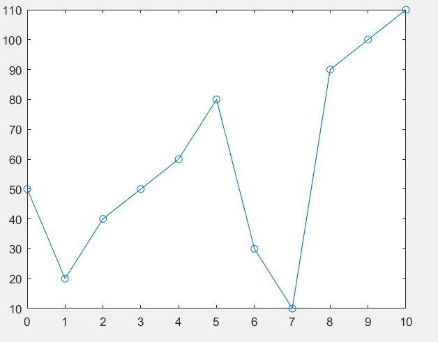
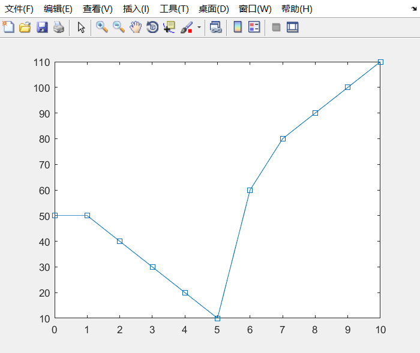
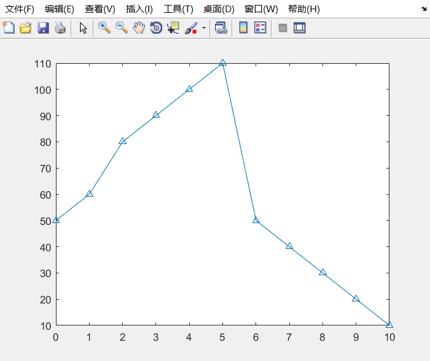
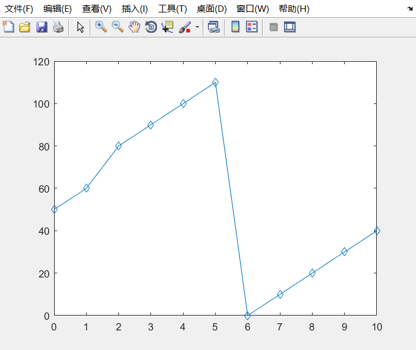
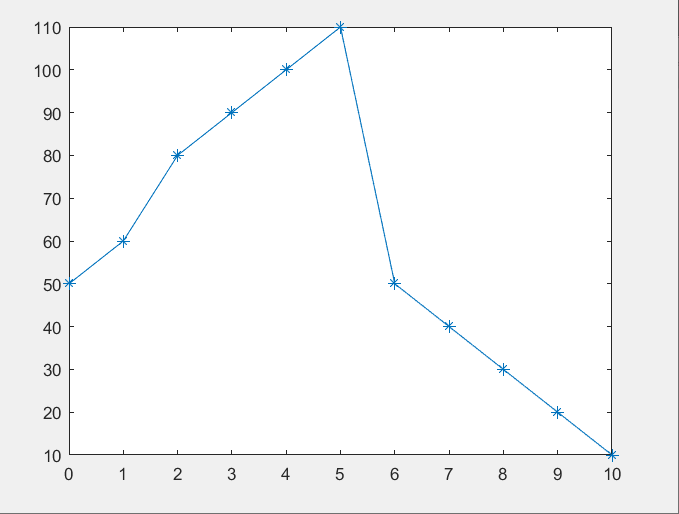

# oslab 06

软件2209 林洋 20222241379

## 补全磁盘调度算法

```c++
/*
 * Filename : dask.cc
 * copyright : (C) 2006 by zhonghonglie
 * Function : 磁盘移臂调度算法
 */
#include "dask.h"
#include <cstdlib>
#include <ctime>
using namespace std;
DiskArm::DiskArm() {
    int i;
    // 输入当前道号
    cout << "Please input Current cylinder :";
    cin >> CurrentCylinder;
    // 磁头方向，输入 0 表示向小道号移动，1 表示向大道号移动
    cout << "Please input Current Direction (0/1) :";
    cin >> SeekDirection;
    // 输入磁盘请求数，请求道号
    cout << "Please input Request Numbers :";
    cin >> RequestNumber;
    cout << "Please input Request cylinder string :";
    Request = new int[sizeof(int) * RequestNumber];
    Cylinder = new int[sizeof(int) * RequestNumber];
    for (i = 0; i < RequestNumber; i++)
        cin >> Request[i];
    cout << endl;
}
DiskArm::~DiskArm() {}
// 初始化道号，寻道记录
void DiskArm::InitSpace(char* MethodName) {
    int i;
    cout << endl << MethodName << endl;
    SeekNumber = 0;
    SeekChang = 0;
    for (i = 0; i < RequestNumber; i++)
        Cylinder[i] = Request[i];
}
// 统计报告算法执行情况
void DiskArm::Report(void) {
    cout << endl;
    cout << "Seek Number: " << SeekNumber << endl;
    cout << "Chang Direction: " << SeekChang << endl;
    cout << "AVG:" << (float)SeekNumber / RequestNumber << endl;
}
// 先来先服务算法
void DiskArm::Fcfs(void) {
    int Current = CurrentCylinder;
    int Direction = SeekDirection;
    InitSpace("FCFS");
    cout << Current;
    for (int i = 0; i < RequestNumber; i++) {
        if (((Cylinder[i] >= Current) && !Direction) ||
            ((Cylinder[i] < Current) && Direction)) {
            // 需要调头
            SeekChang++;             // 调头数加 1
            Direction = !Direction;  // 改变方向标志
            // 报告当前响应的道号
            cout << endl << Current << " -> " << Cylinder[i];
        } else  // 不需调头，报告当前响应的道号
            cout << " -> " << Cylinder[i];
        // 累计寻道数，响应过的道号变为当前道号
        SeekNumber += abs(Current - Cylinder[i]);
        Current = Cylinder[i];
    }
    // 报告磁盘移臂调度的情况
    Report();
}
// 最短寻道时间优先算法
void DiskArm::Sstf(void) {
    int Shortest;
    int Distance = 999999;
    int Direction = SeekDirection;
    int Current = CurrentCylinder;
    InitSpace("SSTF");
    cout << Current;
    for (int i = 0; i < RequestNumber; i++) {
        // 查找当前最近道号
        for (int j = 0; j < RequestNumber; j++) {
            if (Cylinder[j] == -1)
                continue;  //-1 表示已经响应过了

            if (Distance > abs(Current - Cylinder[j])) {
                // 到下一道号比当前距离近，下一道号为当前距离
                Distance = abs(Current - Cylinder[j]);
                Shortest = j;
            }
        }
        if (((Cylinder[Shortest] >= Current) && !Direction) ||
            ((Cylinder[Shortest] < CurrentCylinder) && Direction)) {
            // 需要调头
            SeekChang++;             // 调头数加 1
            Direction = !Direction;  // 改变方向标志
            // 报告当前响应的道号
            cout << endl << Current << " -> " << Cylinder[Shortest];
        } else  // 不需调头，报告当前响应的道号
            cout << " -> " << Cylinder[Shortest];
        // 累计寻道数，响应过的道号变为当前道号
        SeekNumber += abs(Current - Cylinder[Shortest]);
        Current = Cylinder[Shortest];
        // 恢复最近距离，销去响应过的道号
        Distance = 999999;
        Cylinder[Shortest] = -1;
    }
    Report();
}

void sort(int* a, int n) {
    for (int i = 0; i < n - 1; i++) {
        for (int j = 0; j < n - i - 1; j++) {
            if (a[j] > a[j + 1]) {
                int temp = a[j + 1];
                a[j + 1] = a[j];
                a[j] = temp;
            }
        }
    }
}

// 电梯调度算法
void DiskArm::Scan(void) {
    int Current = CurrentCylinder;
    int Direction = SeekDirection;
    InitSpace("SCAN");
    int point = 0;
    for (int i = 0; i < RequestNumber; i++) {
        if (Cylinder[i] <= Current)
            point++;
    }  // 标记
    sort(Cylinder, RequestNumber);  // 升序排列
    cout << Current << " ";

    if (Direction == 0) {
        for (int i = point - 1; i >= 0; i--) {
            cout << "-> " << Cylinder[i] << " ";
        }
        cout << "->" << 0;
        SeekChang++;
        SeekNumber += abs(Current - 0);
        cout << endl;
        for (int i = point; i < RequestNumber; i++) {
            cout << "-> " << Cylinder[i] << " ";
        }
        SeekNumber += abs(Cylinder[RequestNumber - 1] - 0);
    }

    else if (Direction == 1) {
        for (int i = point; i < RequestNumber; i++) {
            cout << "-> " << Cylinder[i] << " ";
        }
        cout << "-> " << 200;
        SeekNumber += abs(200 - Current);
        SeekChang++;
        cout << endl;
        for (int i = point - 1; i >= 0; i--) {
            cout << "-> " << Cylinder[i] << " ";
        }
        SeekNumber += abs(200 - Cylinder[0]);
    }
    Report();
}

// 均匀电梯调度算法
void DiskArm::CScan(void) {
    int Current = CurrentCylinder;
    int Direction = SeekDirection;
    InitSpace("CSCAN");
    int point = 0;
    for (int i = 0; i < RequestNumber; i++) {
        if (Cylinder[i] <= Current)
            point++;
    }
    sort(Cylinder, RequestNumber);  // 升序排列
    cout << Current << " ";

    if (Direction == 0) {
        for (int i = point - 1; i >= 0; i--) {
            cout << "-> " << Cylinder[i] << " ";
        }
        cout << "-> " << 0;  // 向左到0
        cout << endl;
        cout << "-> " << 200;
        SeekChang++;
        SeekNumber += abs(Current - 0);  // 向左移动到0的距离
        SeekNumber += 200;               // 从0到200
        cout << endl;
        SeekChang++;
        for (int i = RequestNumber - 1; i >= point; i--) {
            cout << "-> " << Cylinder[i] << " ";
        }
        SeekNumber +=
            abs(200 - Cylinder[point + 1]);  // 200到最后一个访问点的距离
    }

    else if (Direction == 1) {
        for (int i = point; i < RequestNumber; i++) {
            cout << "-> " << Cylinder[i] << " ";
        }
        cout << "-> " << 200;
        cout << endl;
        cout << "-> " << 0;
        SeekNumber += abs(200 - Current) + 200;
        SeekChang++;
        cout << endl;
        SeekChang++;
        for (int i = 0; i <= point - 1; i++) {
            cout << "-> " << Cylinder[i] << " ";
        }
        SeekNumber += abs(Cylinder[point - 1] - 0);
    }
    Report();
}
// LOOK 调度算法
void DiskArm::Look(void) {
    int Current = CurrentCylinder;
    int Direction = SeekDirection;
    InitSpace("LOOK");
    int point = 0;
    for (int i = 0; i < RequestNumber; i++) {
        if (Cylinder[i] <= Current)
            point++;
    }
    sort(Cylinder, RequestNumber);  // 升序排列
    cout << Current << " ";

    if (Direction == 0) {
        for (int i = point - 1; i >= 0; i--) {
            cout << "-> " << Cylinder[i] << " ";
        }
        SeekChang++;
        SeekNumber += abs(Current - Cylinder[0]);
        cout << endl;
        for (int i = point; i < RequestNumber; i++) {
            cout << "-> " << Cylinder[i] << " ";
        }
        SeekNumber += abs(Cylinder[RequestNumber - 1] - Cylinder[0]);
    }

    else if (Direction == 1) {
        for (int i = point; i < RequestNumber; i++) {
            cout << "-> " << Cylinder[i] << " ";
        }
        SeekNumber += abs(Cylinder[RequestNumber - 1] - Current);
        SeekChang++;
        cout << endl;
        for (int i = point - 1; i >= 0; i--) {
            cout << "-> " << Cylinder[i] << " ";
        }
        SeekNumber += abs(Cylinder[RequestNumber - 1] - Cylinder[0]);
    }
    Report();
}

// 程序启动入口
int main(int argc, char* argv[]) {
    // 建立磁盘移臂调度类
    DiskArm* dask = new DiskArm();
    // 比较和分析 FCFS 和 SSTF 两种调度算法的性能
    dask->Fcfs();
    dask->Sstf();
    dask->Scan();
    dask->CScan();
    dask->Look();
}
```

输出结果如下：

```shell
linyang@LAPTOP-LINYANG:~/Code/oslab/oslab06$ ./dask
Please input Current cylinder :53
Please input Current Direction (0/1) :0
Please input Request Numbers :8
Please input Request cylinder string :98 183 37 122 14 124 65 67


FCFS
53
53 -> 98 -> 183
183 -> 37
37 -> 122
122 -> 14
14 -> 124
124 -> 65
65 -> 67
Seek Number: 640
Chang Direction: 7
AVG:80

SSTF
53
53 -> 65 -> 67
67 -> 37 -> 14
14 -> 98 -> 122 -> 124 -> 183
Seek Number: 236
Chang Direction: 3
AVG:29.5

SCAN
53 -> 37 -> 14 ->0
-> 65 -> 67 -> 98 -> 122 -> 124 -> 183 
Seek Number: 236
Chang Direction: 1
AVG:29.5

CSCAN
53 -> 37 -> 14 -> 0
-> 200
-> 183 -> 124 -> 122 -> 98 -> 67 -> 65 
Seek Number: 386
Chang Direction: 2
AVG:48.25

LOOK
53 -> 37 -> 14 
-> 65 -> 67 -> 98 -> 122 -> 124 -> 183 
Seek Number: 208
Chang Direction: 1
AVG:26
```

改进 `DiskArm` 函数，使其能够*随机产生磁盘柱面请求序列*

```c++
DiskArm::DiskArm() {
    int i;
    // 输入当前道号
    cout << "Please input Current cylinder :";
    cin >> CurrentCylinder;
    // 磁头方向，输入 0 表示向小道号移动，1 表示向大道号移动
    cout << "Please input Current Direction (0/1) :";
    cin >> SeekDirection;
    // 输入磁盘请求数，请求道号
    cout << "Please input Request Numbers :";
    cin >> RequestNumber;
    cout << "Please input Request cylinder string :";
    Request = new int[sizeof(int) * RequestNumber];
    Cylinder = new int[sizeof(int) * RequestNumber];
    // 随机产生磁盘柱面请求序列
    srand(static_cast<unsigned>(time(0)));
    for (int i = 0; i < RequestNumber; i++) {
        // 假设磁道号范围为 0-199
        Request[i] = rand() % 200;
    }
    for (int j = 0; j < RequestNumber; j++) {
        cout << Request[j] << " ";
    }
    cout << endl;
}
```

进行测试：

```shell
linyang@LAPTOP-LINYANG:~/Code/oslab/oslab06$ ./dask
Please input Current cylinder :53
Please input Current Direction (0/1) :0
Please input Request Numbers :8
Please input Request cylinder string :1 185 182 68 4 14 20 146 

FCFS
53 -> 1
1 -> 185
185 -> 182 -> 68 -> 4
4 -> 14 -> 20 -> 146
Seek Number: 559
Chang Direction: 3
AVG:69.875

SSTF
53
53 -> 68
68 -> 20 -> 14 -> 4 -> 1
1 -> 146 -> 182 -> 185
Seek Number: 266
Chang Direction: 3
AVG:33.25

SCAN
53 -> 20 -> 14 -> 4 -> 1 ->0
-> 68 -> 146 -> 182 -> 185 
Seek Number: 238
Chang Direction: 1
AVG:29.75

CSCAN
53 -> 20 -> 14 -> 4 -> 1 -> 0
-> 200
-> 185 -> 182 -> 146 -> 68 
Seek Number: 307
Chang Direction: 2
AVG:38.375

LOOK
53 -> 20 -> 14 -> 4 -> 1 
-> 68 -> 146 -> 182 -> 185 
Seek Number: 236
Chang Direction: 1
AVG:29.5
```

## 多次运行程序进行测试

运行 10 次 `dask` 以生成 10 个不同的磁盘柱面请求序列，其产生的磁盘柱面请求序列分别为：

```shell
183 86 177 115 193 135 186 92 
49 21 162 27 90 59 163 126 
140 26 172 136 11 168 167 29 
182 130 62 123 67 135 129 2 
22 58 69 167 193 56 11 42 
29 173 21 119 184 137 198 124 
115 170 13 126 91 180 156 73 
62 170 196 81 105 125 84 127 
136 105 46 129 113 57 124 95 
182 145 14 167 34 164 43 150
```

通过比对结果我们可以得出以下结论：

磁盘调度算法是操作系统中用于决定磁盘I/O请求处理顺序的算法。每种算法都有其特定的性能特点和适用场景。以下是您提到的五种磁盘调度算法的性能概述和适用场景：

1. 先来先服务算法
   - 性能：FCFS 算法按照请求到达的顺序进行服务，实现简单，但在请求分布不均匀时可能导致磁头移动距离较长
   - 适用场景：请求顺序接近于磁头当前位置的顺序，或者对公平性要求较高的场景

2. 最短寻道时间优先算法
   - 性能：SSTF 选择与当前磁头位置距离最近的请求进行服务，可以减少磁头移动的总距离，提高性能，但可能导致“饥饿”现象
   - 适用场景：请求较为分散，且对响应时间有较高要求的场景

3. 电梯调度算法
   - 性能：可以减少磁头移动距离，提高效率
   - 适用场景：请求在磁盘两端较为集中的场景，可以提高磁头移动的效率

4. 均匀电梯调度算法
   - 性能：C-SCAN 是 SCAN 算法的改进，它在到达磁盘末端后不是立即反向，而是在磁盘的另一端等待新的请求，这样可以减少磁头在磁盘末端的空闲时间
   - 适用场景：请求较为均匀分布在磁盘上的场景，可以提高磁盘的整体利用率

5. LOOK调度算法
   - 性能：LOOK 算法在处理请求时会“看”向一个方向，直到没有更多的请求，然后转向另一个方向。它试图减少磁头的回溯移动
   - 适用场景：请求分布不规律，且需要减少磁头回溯移动的场景

## 算法说明

### Scan 算法

函数开始时，首先获取当前磁道`Current`和寻找方向`Direction`。然后，初始化一个名为`SCAN`的空闲磁道。接下来，遍历请求磁道数组`Cylinder`，计算请求磁道数组中不大于当前磁道的请求数量`point`

接下来对请求磁道数组进行升序排列。然后，根据当前磁道和寻找方向，分别计算电梯的移动路径。如果寻找方向为0，即从当前磁道向左移动，则从`point-1`开始遍历请求磁道数组，直到遍历完整个数组。在遍历过程中，输出电梯的移动路径

最后计算电梯移动的总距离`SeekNumber`，并输出结果

### C-Scan 算法

遍历磁道请求队列，统计磁道号小于等于当前磁道号的请求数量

然后对磁道请求队列进行升序排列，如果磁头移动方向为0（向左），则从当前磁道开始，依次访问磁道号最小的请求，直到访问完所有请求。在访问过程中，磁头始终朝左移动，当到达磁盘的左边界时，再改变方向继续访问；如果磁头移动方向为1（向右），则从当前磁道开始，依次访问磁道号最大的请求，直到访问完所有请求。在访问过程中，磁头始终朝右移动，当到达磁盘的右边界时，再改变方向继续访问

最后调用 `Report` 函数输出磁盘访问顺序和磁头移动距离

### Look 算法

遍历请求队列，统计当前磁道号小于等于当前磁盘指针 CurrentCylinder 的请求数量 point

之后对请求队列进行升序排列，如果当前磁盘指针 CurrentCylinder 与请求队列中的第一个请求的磁道号相等，则直接输出当前磁盘指针 CurrentCylinder，并更新磁盘访问距离 SeekNumber

如果当前磁盘指针 CurrentCylinder 与请求队列中的最后一个请求的磁道号相等，则先输出当前磁盘指针 CurrentCylinder，再输出请求队列中的所有请求，并更新磁盘访问距离 SeekNumber；如果当前磁盘指针 CurrentCylinder 与请求队列中的其他请求的磁道号不相等，则根据当前磁盘指针 CurrentCylinder 与请求队列中的第一个请求的磁道号之间的距离，选择一个最优的访问顺序，并输出访问顺序，同时更新磁盘访问距离 SeekNumber 和磁盘访问次数SeekChang

最后输出磁盘访问距离SeekNumber和磁盘访问次数SeekChang

## 寻道曲线图

###  FCFS 算法



### SSTF 算法



### SCAN 算法



### C-SCAN 算法



### LOOK 算法


